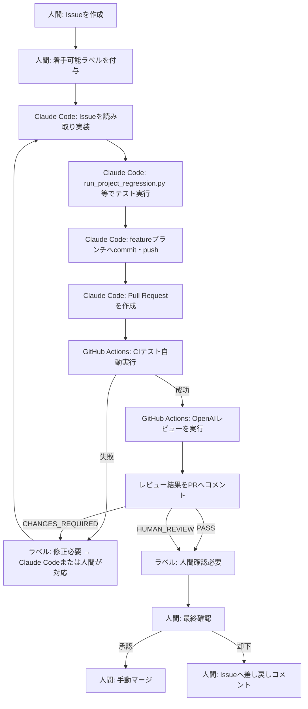
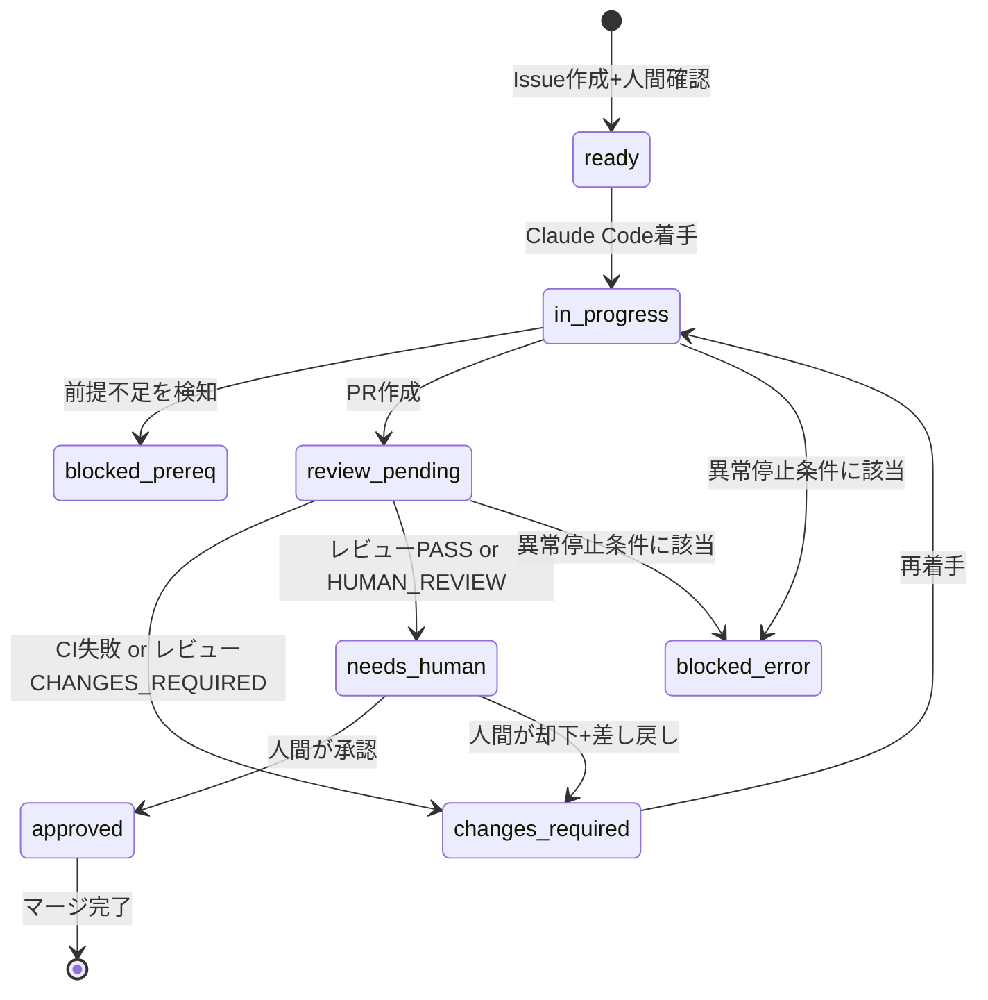

# AUTO-001-01 GitHub Issue／Pull Request自動化の現状調査・基本設計

管理ID: AUTO-001-01
作業worktree: `C:\Users\tensh\eigo-radio-auto-001`（ブランチ `automation/AUTO-001`）
調査時点HEAD: `90d7bb94fe5d20cbbb4a44d54f2b776c6ccbe898`

本ドキュメントは調査と設計のみを目的とし、コード・設定・ワークフローの実装は含まない。

---

## 1. 調査日時点の前提

* 調査を行ったworktree: `C:\Users\tensh\eigo-radio-auto-001`
* ブランチ: `automation/AUTO-001`
* 起点HEAD: `90d7bb94fe5d20cbbb4a44d54f2b776c6ccbe898`（`main`と同一コミット、AUTO-001-00で作成）
* AUTO-001-00完了直後の状態から変更なし（`git status`はクリーンのまま調査を実施）
* メイン開発側（`C:\Users\tensh\eigo-radio`、`main`）には未追跡の生成物ファイルが多数存在するが、本worktreeには存在しない
* 本調査では外部APIを一切呼び出していない（GitHub API、OpenAI API、Anthropic APIいずれも未使用）
* `git fetch`は実行していない。remote追跡情報はローカルに保存済みの最終fetch時点（後述）のもの

---

## 2. 現在のGit・ブランチ状態

| 項目 | 値 |
|---|---|
| 現在のパス | `C:\Users\tensh\eigo-radio-auto-001` |
| 現在のブランチ | `automation/AUTO-001` |
| 現在のHEAD | `90d7bb9`（ER-003-B1-P6B Stage1） |
| `git status` | `nothing to commit, working tree clean` |
| remote | `origin` = `https://github.com/shimomura055/eigo-radio.git`（1件のみ） |
| `origin/main`（ローカルキャッシュ） | `d769d31`（ER-002-v1.2M-R4-FINALIZE関連の直後） |
| ローカル`main`とHEADの関係 | 完全一致（両方とも`90d7bb9`） |

### origin/mainとの関係

* HEAD（=ローカル`main`）は`origin/main`の**56コミット先行・0コミット遅れ**
* つまりローカル`main`には、GitHubへ未pushのコミットが56件存在する（ER-003関連の実験・停止記録が中心）
* ローカル`main`にのみ存在し`origin/main`に存在しないコミットの先頭は`7742945`（ER-002-S2/S2-C2）、末尾（最新）は`90d7bb9`
* 最終fetch時刻はローカルreflogから`2026-07-19 12:47:05 +0900`と推定される。調査日（2026-07-27）から約8日経過しており、`origin/main`側の実際の最新状態（他端末や手動操作でのpush有無）はこのローカル情報だけでは保証できない。**`git fetch`による最新化が必要**（今回は実行していない）
* CLAUDE.mdの運用ルールにより、意味のある変更は原則都度`origin/main`へpushされる方針だが、実際には56コミット分のpush遅延が生じている。自動化設計にあたっては「ローカルmainの先行状態」を前提にしない（Issue/PR自動化はGitHub上の状態を正として動くため、ローカルの先行コミットとは独立に成立する）

### AUTO-001ブランチを将来PR化する場合の注意点

* `automation/AUTO-001`は現状`main`と同一内容（起点HEADのみ）であり、差分はまだ0
* 本ブランチを将来PRにする場合、比較先は`main`ではなく`origin/main`にすべき（`main`はorigin/mainより56コミット先行しているため、`main`との比較では無関係なER-003コミットまで差分に含まれてしまう）
* GitHub上でPRを作成する際は、まずローカル`main`側の56コミットをpushして`origin/main`と同期するか、少なくとも「`origin/main`起点からの差分」であることをPR説明に明記する必要がある

---

## 3. 現在のGitHub関連設定

`.github`ディレクトリは**存在しない**。以下はすべて未設定・未導入。

| 項目 | 状態 |
|---|---|
| `.github/workflows`（GitHub Actions） | なし |
| Issueテンプレート | なし |
| Issue Form（`.github/ISSUE_TEMPLATE/*.yml`） | なし |
| Pull Requestテンプレート | なし |
| CODEOWNERS | なし |
| Dependabot設定 | なし |
| その他GitHub自動化設定 | なし |

既存ワークフローが存在しないため、「ファイル名・トリガー・使用Action・permissions・Secrets」等の整理項目は該当なし。**今回のAUTO-001シリーズが、このリポジトリで最初のGitHub Actions導入になる**。

---

## 4. 現在のClaude Code関連設定

| 項目 | 状態 |
|---|---|
| `CLAUDE.md` | リポジトリ直下に存在（1779バイト）。内容は「説明方法（責任者向け、変更理由→内容→効果→リスクの順）」「開発方針（安定性優先、大規模変更前に説明）」「Git運用ルール（意味のある変更は自動commit・push、ただし履歴書き換え・大規模リファクタ・エラー・動作確認失敗時はユーザー確認必須）」の3点 |
| `.claude`ディレクトリ | リポジトリ内に**存在しない**（コミット済みのhooks/settings/commandsなし） |
| Claude Code用コマンド・hooks・settings | リポジトリ内に確認できるものはなし（ユーザー環境側の`~/.claude`設定はリポジトリ調査の対象外） |
| GitHub連携に関する既存設定 | なし（Claude Code GitHub Appは未インストール、Claude Code Actionは未導入） |
| Claude Codeが実行を許可されているコマンド | リポジトリ内に明示的な許可リストは存在しない。CLAUDE.mdの記述から「commit・push（origin/main）は通常運用で自動実行可」「amend/rebase/force push、大規模リファクタ、エラー時、動作確認失敗時はユーザー確認必須」と読み取れる |
| Claude Codeが変更してはいけない領域 | CLAUDE.md上に明示リストはない。ただし本タスク（AUTO-001-01）自体の指示で「ER-001/002/003コード」「サービス仕様」への変更は非対象と明記されている |
| 既存設定とClaude Code GitHub Actionsの競合可能性 | 現時点で競合するリポジトリ側設定は存在しない。ただしCLAUDE.mdの「意味のある変更は自動commit・push」ルールは**ローカルインタラクティブセッション向け**であり、GitHub Actions上でClaude Codeを動かす場合はこのルールをそのまま適用せず、Actions側の許可コマンド・書き込み範囲を別途明示的に定義する必要がある（フェーズ設計の§18で扱う） |

---

## 5. 開発環境

| 項目 | 内容 |
|---|---|
| 主な言語 | Python（リポジトリ直下だけで`.py`ファイル171件、トラッキング対象Python合計約50,020行） |
| Node.js | ローカル環境に未インストール（`node`コマンド不明）。リポジトリ内にNode由来のコードは確認されていない |
| Python バージョン指定 | リポジトリ内に`pyproject.toml`・`requirements.txt`・`Pipfile`・`setup.py`・`setup.cfg`・`environment.yml`のいずれも**存在しない**。バージョン固定・依存関係管理ファイルが一切ない状態。調査環境のPythonは3.14.6だが、これがプロジェクトの前提バージョンかは確認できない |
| 依存パッケージ | コード内の`import`から使用ライブラリは推測できる（`openai`、`google.generativeai`系、`boto3`等）が、バージョン固定情報がないためCI環境の再現性に懸念あり |
| Windows依存コマンド・パス | スクリプト本体には`C:\Users`やドライブレター直書き、`.venv\Scripts`直書きは確認されなかった（0件）。ただしテストファイルのdocstring内に実行例として`.venv/Scripts/python.exe -m unittest ...`という**Windows venv構造前提のコメント**が複数存在する（コードではなくコメント） |
| Linux GitHub Actions上で問題になりそうな処理 | (a) 依存関係管理ファイルが無いため、CI側で何をpip installすべきか自明でない (b) `.gitattributes`で複数の正本ファイルに`-text`（改行変換無効化）指定があり、sha256整合性チェックに依存するテストが存在する。Linuxランナーでも`-text`指定自体は有効だが、チェックアウト設定を誤ると凍結データの改ざん判定に影響しうる (c) 一部モジュールがGoogle Cloud TTS / Amazon Polly / Azure Speech等の外部音声APIやMFA（Montreal Forced Aligner、`mfa_tool/`はgitignore対象）に依存しており、CI環境にそれらのバイナリ・認証情報は存在しない |
| 生成物・大容量ファイルの保存場所 | `er002_output/`・`er003_output/`配下（JSON・Markdown中心、**大部分はGit追跡対象**）。音声実体（`*.wav`）・元記事全文キャッシュ・ベンチマークPDF・MFA環境一式は`.gitignore`で明示的に除外 |
| `.gitignore`の状態 | `.env`・`.venv/`・`__pycache__`・`*.wav`・`episode_*.json`・`topic_package_*`・A/B比較の話者対応表・一時ディレクトリ・MFA環境（`mfa_tool/`）等を除外。**生成JSON成果物自体は原則追跡対象**という方針がコメントで明記されている |

---

## 6. 現在のテスト構成

### 標準テストコマンド

`TESTING.md`により、正式なproject-wide regressionの入口は1つだけと明文化されている。

```text
python run_project_regression.py
```

* `run_project_regression.py`自身の場所を基準にrepository rootを解決するため、実行ディレクトリに依存しない
* 探索パターン: `er0*_test_*.py`（固定、`--pattern`で上書き可能だが通常使用しない）
* 対象: `er002_test_*.py`（ER-002） + `er003_test_*.py`（ER-003）
* 対象外: `test_api.py`、`generate_test.py`、`tts_test.py`等、命名規則に従わない単発検証スクリプト
* ER-001: unittest形式の回帰テストは現時点で存在しない
* `unittest`の`discover()`によるglob自動探索のみが正式手順。手動でのtest module列挙は過去に対象範囲の食い違い（ER-003-P2J、1032件 vs 660件）を起こした前例があり、正式手順から除外されている
* 終了コード: 全件成功時`0`、収集0件または1件でも失敗/エラーがあれば`0`以外
* `--json-summary <path>`でcollected/passed/failed/skippedをJSON出力可能（CI連携に活用できる）

### テストファイルの内訳

* `er0*_test_*.py`該当ファイル数: **44件**
* このうち41件が、ファイル冒頭コメントに「実TTS呼び出しは行わない」「実APIは呼ばない」等の**明示的な非実API宣言**を持つ
* テストファイル内から`openai`・`anthropic`・`boto3`・`google.*`等の外部APIクライアントを直接`import`しているものは**0件**
* テストファイル内から`requests.get/post`・`urlopen`・`httpx`等のHTTP直接呼び出しを行っているものも**0件**
* 一部（`er003_test_b1_p2.py`、`er003_test_b1_p3r_audio.py`）は`@unittest.skipUnless(os.path.exists(...))`により、対応する生成物ファイルが無い場合は自動スキップする構造

### 実行時間

* 今回は調査目的の実行を行っていない（外部APIを呼ばずファイル変更も伴わない最小実行として`run_project_regression.py`自体は安全に実行できると判断できるが、受入条件「テスト実行は原則不要」に従い未実施）
* ファイル数（44）・総行数（約5万行の一部）から判断すると、単体テストは軽量なロジック検証中心であり、フルスイートはCI上で数分程度に収まる可能性が高いが、実測値ではないため**推定にとどまる**（AUTO-001-02以降で実測を推奨）

### 外部APIを呼ぶ／呼ばないテストの区分

| 区分 | 内容 |
|---|---|
| 外部APIを呼ばないテスト | `er0*_test_*.py`パターンに合致する44ファイルすべて。保存済み生成物（JSON/Markdown）を読み込んでロジックを検証する方式が基本 |
| 外部APIを呼ぶ可能性があるスクリプト | `er0*_test_*.py`の命名規則に**従わない**スクリプト群（`test_api.py`、`generate_test.py`、`tts_test*.py`、各`*_generate.py`、`*_compare.py`等）。これらは"テスト"という名前を含むものもあるが、実体はAPI疎通確認・実データ生成スクリプトであり、`run_project_regression.py`の対象外 |
| APIキーが必要なテスト | 上記の生成系スクリプト。`OPENAI_API_KEY`相当（コード内では`GEMINI_API_KEY`、AWS認証情報、`GOOGLE_APPLICATION_CREDENTIALS`、Azure `SPEECH_KEY`/`SPEECH_REGION`を確認）を必要とする |
| 保存済みレスポンスだけで実行できるテスト | `er0*_test_*.py`44ファイル全て（設計上の前提） |
| GitHub Actions上で安全に実行可能なテスト | `python run_project_regression.py`のみ。ただし前提として`er002_output/`・`er003_output/`配下の追跡済み生成物ファイルがcheckout時に揃っていることが必要（384+205ファイルがGit追跡対象と確認済み） |

### Windows固有パス・大容量成果物への依存

* テストコード自体にWindows固有パスの直書きは確認されなかった
* テストファイルのdocstring（コメント）にWindows venv構造前提の実行例が残っており、CI導入時にはLinux向けの実行例（`.venv/bin/python`相当、あるいは単に`python`）へ読み替えが必要
* 音声ファイル（`*.wav`）は`.gitignore`対象のためリポジトリには存在せず、テストは音声実体ではなくメタデータ（JSON）に依存する設計になっている（CI親和性は高い）

---

## 7. 現在のGit運用上のリスク

| リスク | 内容 |
|---|---|
| mainへの直接コミット前提の運用 | CLAUDE.mdの現行ルールは「ローカルで作業→commit→`origin/main`へ直接push」を前提としている。PRベースの自動化フローとは運用モデルが異なり、**Issue駆動自動化の導入にあたりこの慣習との整合を取る必要がある**（少なくとも自動化対象の変更はfeatureブランチ＋PR経由に限定すべき） |
| 未追跡成果物の混入リスク | メイン開発側（`eigo-radio`本体）には現時点で100件超の未追跡ファイルが存在する（AUTO-001-00調査時点で104件）。これらはAUTO-001 worktreeには混入していないが、将来Claude CodeがGitHub Actions上でPRを作成する際、意図しないローカル生成物を`git add`してしまうリスクがある |
| `git add .`による事故 | 依存関係管理ファイルが存在せず、`.gitignore`のカバレッジも生成物パターンに依存した個別ルール（`episode_*.json`、`topic_package_*`等）のため、新しい種類の生成物が追加された際に想定外のファイルが`git add .`で混入する可能性がある |
| GitHub Actionsが生成物をコミットする可能性 | もしCI上でテスト実行や記事生成を伴うワークフローを組んだ場合、実行環境が生成した一時ファイルを誤ってcommitしてしまうリスクがある。Actions側のワークフローでは生成物の扱い（コミットする/しない）を明示的に制御する必要がある |
| 自動生成物をPRへ含めるべきか | 本リポジトリの既存方針（`.gitignore`コメント）では、生成JSON成果物は原則追跡対象、音声等の大容量バイナリは対象外という区別が既にある。AUTO-001でのPRもこの既存方針を踏襲すべきだが、自動化タスク（Issue対応）のPRに実験成果物が混ざらないよう、**PRテンプレート上で「生成物の有無」を明示させる**設計が必要（§11で対応） |
| 実験成果物と正式コードの区別 | `er002_output/`・`er003_output/`は実験ログ的な性格が強く、コード変更と生成物変更が同一PRに混在すると差分レビューが困難になる。自動化PRでは可能な限り「コード変更」と「生成物変更」を意識的に分離することが望ましい |
| 複数worktree運用との競合 | AUTO-001-00で構築した専用worktree運用は、メイン開発（`eigo-radio`）と自動化開発（`eigo-radio-auto-001`）を分離する設計であり、現時点で競合は確認されていない。ただしCI上のジョブが同時に複数起動した場合の同時実行制御（後述の重複起動防止）は別途設計が必要 |

---

## 8. 推奨アーキテクチャ（GitHub上の処理フロー）

初期MVPでは**自動修正ループと自動マージを含めない**、単方向・都度人間確認ありのフローとする。



要点:

* Claude Codeによる実装・PR作成までは自動
* CIテストとOpenAIレビューも自動
* **マージは常に人間が手動で行う**（AIによる自動マージは行わない、§15参照）
* `CHANGES_REQUIRED`判定時に自動で修正ループへ入る機能は初期MVPには含めない（人間が「修正必要」ラベルを見て次のアクションを判断する）

---

## 9. ラベルと状態遷移

| ラベル | 意味 | 付与対象 | 遷移トリガー |
|---|---|---|---|
| `status:ready` | 着手可能 | Issue | 人間がタスク内容を確定させ付与 |
| `status:in-progress` | 実装中 | Issue | Claude Codeが着手時に付与 |
| `status:review-pending` | レビュー待ち | PR | PR作成時、CI開始前後に付与 |
| `status:changes-required` | 修正必要 | PR | CI失敗、またはOpenAIレビューが`CHANGES_REQUIRED`判定時 |
| `status:needs-human` | 人間確認必要 | PR | OpenAIレビューが`PASS`または`HUMAN_REVIEW`判定時 |
| `status:approved` | 人間承認済み | PR | 人間が確認しマージ可と判断した時点 |
| `status:blocked-error` | 異常停止 | Issue/PR | §17の異常停止条件に該当した時点でClaude Code/Actionsが付与 |
| `status:blocked-prereq` | 前提不足による停止 | Issue | Issue記載内容が実装に不十分と判断された時点でClaude Codeが付与 |

状態遷移図:



命名は`status:`プレフィックスで統一し、将来カテゴリラベル（例: `er002`/`er003`/`infra`）を追加しても衝突しないようにする。

---

## 10. Issueフォーム案

`.github/ISSUE_TEMPLATE/task.yml`相当の項目案（実装は非対象）。

| 項目 | 型 | 必須 | 説明 |
|---|---|---|---|
| 管理ID | 短文 | 必須 | 例: `AUTO-001-02`。既存の管理ID命名規則を踏襲 |
| 背景 | 長文 | 必須 | なぜこのタスクが必要か |
| 目的 | 長文 | 必須 | 達成したいゴール |
| 期待動作 | 長文 | 必須 | 実装後にどう振る舞うべきか、具体例を含める |
| 非対象範囲 | 長文 | 必須 | 今回のIssueで扱わないこと（暴走防止のため必須項目とする） |
| 受入条件 | チェックリスト形式長文 | 必須 | OpenAIレビューが評価する条件そのもの。条件IDを振れる形式にする（§13と対応） |
| テスト観点 | 長文 | 必須 | どのテストで検証するか（`run_project_regression.py`の対象か、targeted testsか） |
| 人間確認が必要な項目 | 長文 | 任意 | サービス仕様変更等、AIだけで判断させない項目を事前に明示 |
| リスク | 長文 | 任意 | 想定される副作用・注意点 |
| 関連Issue/PR | 短文 | 任意 | `#123`形式で相互参照 |

設計方針: 「非対象範囲」「人間確認が必要な項目」を必須/推奨項目として明示させることで、Claude Codeの実装スコープの暴走を防ぐ。既存のAUTO-001-00/01タスク指示書（本ドキュメントの元になった指示自体）の構成（目的・実施内容・実行してはいけないこと・例外処理・受入条件・報告形式）と親和性が高く、そのままIssueフォーム設計に転用できる。

---

## 11. Pull Requestテンプレート案

`.github/pull_request_template.md`相当の項目案。

```markdown
## 関連Issue
Closes #

## 管理ID


## 変更内容


## 変更理由


## サービス仕様変更の有無
- [ ] あり（内容: ）
- [ ] なし

## 実装方法だけの変更か
- [ ] はい（内部実装のみ、外部から見た挙動は不変）
- [ ] いいえ

## 実行したテスト
### Targeted tests
- command:
- scope:
- passed / failed / skipped:

### Project-wide regression
- command: `python run_project_regression.py`
- scope: ER-002 + ER-003 (er0*_test_*.py)
- collected / passed / failed / skipped:

## 未実施テスト


## 人間確認が必要な項目


## 既知のリスク


## 生成物の有無
- [ ] あり（対象パス: 、コミット済み/未コミットの別: ）
- [ ] なし
```

`TESTING.md`の既存ルール（「subsetだけの結果をプロジェクト全体と書かない」「commandを示さずに全テスト成功と書かない」）をテンプレート構造に組み込み、targeted testsとproject-wide regressionを必ず分離記載させる。

---

## 12. Claude実装報告スキーマ案

Claude CodeがPR本文またはPRコメントとして出力する構造化データ（JSON）案。人間可読なMarkdownへの変換はActions側で行う想定。

```json
{
  "issue_number": 0,
  "management_id": "AUTO-001-02",
  "implemented": [
    {"description": "...", "files": ["path/to/file.py"]}
  ],
  "tests_executed": [
    {
      "command": "python run_project_regression.py",
      "scope": "ER-002 + ER-003 project-wide regression",
      "collected": 0,
      "passed": 0,
      "failed": 0,
      "skipped": 0,
      "success": true
    }
  ],
  "tests_not_executed": [
    {"description": "...", "reason": "..."}
  ],
  "assumed_working_not_verified": [
    {"description": "...", "reason": "..."}
  ],
  "requires_human_judgement": [
    {"description": "...", "reason": "..."}
  ],
  "incomplete_items": [
    {"description": "...", "reason": "..."}
  ],
  "git_state": {
    "committed": true,
    "commit_sha": "",
    "pushed": true,
    "branch": "",
    "pr_created": true,
    "pr_number": 0
  }
}
```

設計上の要点:

* 「実装した内容」「実際に実行したテスト」「テスト成功」「テスト未実行」「推測上動くもの」「人間判断が必要なもの」「未完了事項」を**別々の配列**として区別し、Claude Codeが曖昧な自己申告（「たぶん動く」を「テスト成功」に混ぜる等）をできない構造にする
* `assumed_working_not_verified`（推測上動くもの）を独立フィールドにすることで、OpenAIレビュー側が「自己申告だけで独立確認されていない箇所」を機械的に検出できるようにする

---

## 13. OpenAIレビュー結果スキーマ案

最上位判定は3種類固定。

```json
{
  "pr_number": 0,
  "overall_verdict": "PASS | CHANGES_REQUIRED | HUMAN_REVIEW",
  "acceptance_criteria": [
    {
      "criterion_id": "AC-1",
      "verdict": "PASS | FAIL | UNKNOWN",
      "rationale": "...",
      "evidence": ["path/to/test_file.py::TestCase::test_x", "path/to/changed_file.py:120"],
      "independently_verified": true,
      "based_on_self_report_only": false,
      "undecidable_reason": null
    }
  ],
  "overall_rationale": "...",
  "flags_for_human": ["サービス仕様変更あり", "生成物の追跡方針が不明瞭"]
}
```

設計上の要点:

* 受入条件（Issueフォームの「受入条件」欄で`AC-1`, `AC-2`のようにID化されたもの）ごとに個別判定を持たせ、全体判定はその集約とする
* `independently_verified`と`based_on_self_report_only`を両方持たせることで、「Claude Codeの実装報告を鵜呑みにしただけ」のPASSと「CIログ・diff・テスト結果を実際に確認した」PASSを区別できるようにする
* `undecidable_reason`により、判定不能な場合に理由を必ず記録させ、無言で`HUMAN_REVIEW`に丸めることを防ぐ
* サービス仕様変更や「人間確認が必要な項目」がPRテンプレートに記載されている場合、OpenAIレビューは自動的に`overall_verdict`を`HUMAN_REVIEW`に倒す設計とする（§16と対応）

---

## 14. GitHub Actions構成案（実装は非対象、案の列挙のみ）

| ワークフロー | 役割 | トリガー | 読み取り対象 | 書き込み対象 | 必要permissions | 必要Secrets | 失敗時 | 人間承認箇所 |
|---|---|---|---|---|---|---|---|---|
| `ci-test.yml` | project-wide regressionの自動実行 | PR作成・更新（`pull_request`） | リポジトリ全体（checkout） | PRへのチェック結果のみ（コミットはしない） | `contents: read`, `checks: write` | なし（外部APIを呼ばない設計のため） | CIステータスをfailにし、`status:changes-required`ラベルを付与 | なし（自動） |
| `ai-review.yml` | OpenAI APIによる受入条件評価 | `ci-test.yml`成功後（`workflow_run`）、または`pull_request`のCI成功後 | PR diff、Issue本文、実装報告（PRコメント） | PRへのレビューコメント、ラベル更新のみ | `contents: read`, `pull-requests: write`, `issues: write` | `OPENAI_API_KEY` | レビュー自体が失敗（API障害等）した場合は`HUMAN_REVIEW`扱いとし例外を握りつぶさない | なし（自動、ただし判定は人間確認ゲートへ接続） |
| `label-sync.yml`（任意） | Issue/PRラベルの状態遷移補助 | ラベル変更、PRクローズ等 | Issue/PRメタデータ | ラベルのみ | `issues: write`, `pull-requests: write` | なし | ラベル不整合を検知したら`status:blocked-error`を付与 | なし（自動） |
| （実装しない）`auto-merge.yml` | 自動マージ | — | — | — | — | — | — | 初期MVPでは**作らない**。将来的にも自動マージは既定で禁止（§15） |

いずれも今回は設計のみで実装しない。特に`ai-review.yml`は外部API（OpenAI）を呼ぶため、Secrets管理・fork PR制御（§15）が最重要事項になる。

---

## 15. Secretsと権限（セキュリティ設計）

| 項目 | 方針 |
|---|---|
| 最小権限 | 各ワークフローのpermissionsは§14表の通り、必要最小限（`contents: read`基本、書き込みが必要な箇所のみ`write`を個別指定）とし、`permissions: write-all`は使わない |
| mainへの直接push禁止 | 自動化ワークフローからの`git push origin main`は行わない。すべてfeatureブランチ＋PR経由とする。ブランチ保護ルール（GitHub Ruleset/branch protection）の設定は今回の非対象範囲だが、**AUTO-001-02以降で有効化を推奨**する事項として記録する |
| AIによる自動マージ禁止 | `auto-merge.yml`は作らない。GitHubの「Auto-merge」機能もワークフローからは有効化しない。マージボタンは常に人間が押す |
| OpenAIレビュー側へのコード書き込み権限禁止 | `ai-review.yml`のpermissionsに`contents: write`を含めない。PRへのコメント・ラベル付与のみ許可し、コードやファイルへの書き込みは一切行わせない |
| Secretsをログ等へ出力しない | ワークフロー内で`echo`等によるSecrets出力を禁止。OpenAI APIレスポンスをそのままログへ出す場合もAPIキー等の機微情報が混入しないことを確認する運用ルールを設ける |
| fork由来PRでSecretsを使わない | `pull_request`イベント（forkからのPRでもSecretsが露出しないデフォルトの安全な権限モデル）を使用し、`pull_request_target`は原則使わない（次項）。fork PRに対してAIレビューを実行する場合は、Secretsを必要としないジョブと分離するか、maintainerの手動承認（`workflow_run`経由等）を挟む設計とする |
| 外部入力をそのままシェル実行しない | Issue本文・PR本文・コミットメッセージ等のユーザー入力をシェルコマンドへ直接展開しない（シェルインジェクション対策）。GitHub Actionsの`${{ }}`式をそのままrunステップに埋め込まず、環境変数経由で渡す |
| `pull_request_target`の利用を原則避ける | 上記の通り。どうしても必要な場合（例: forkPRへのラベル付与のみ）は、チェックアウトするコードを実行しない用途に限定する |
| 外部Actionのバージョン固定 | `actions/checkout@v4`のようなタグ指定ではなく、可能な限りコミットSHA固定を検討（少なくともメジャーバージョンタグ固定は必須） |
| API利用回数の上限 | OpenAI API呼び出しは1PRあたりの実行回数に上限を設ける（例: 1PRにつき初回レビュー1回＋再実行は人間トリガーのみ）。無制限の自動再試行は行わない |
| タイムアウト | 各ジョブに`timeout-minutes`を明示的に設定し、ハングによる課金・リソース消費を防ぐ |
| 同一処理の重複起動防止 | `concurrency`キー（例: `pr-review-${{ github.event.pull_request.number }}`）を設定し、同一PRへの連続pushで前回のレビュー実行をキャンセル・重複起動を防止する |

---

## 16. 人間承認ゲート

以下の箇所は設計上、人間の判断を必須とする。

1. **Issue着手許可**: `status:ready`ラベルを人間が付与するまでClaude Codeは着手しない
2. **サービス仕様変更を含むPR**: PRテンプレートの「サービス仕様変更の有無」が「あり」の場合、OpenAIレビューの判定に関わらず必ず`status:needs-human`とする
3. **OpenAIレビューが`HUMAN_REVIEW`判定の場合**: 理由を明示した上で人間が最終判断
4. **マージ操作そのもの**: 常に人間が実施（§15）
5. **異常停止・前提不足からの再開**: `status:blocked-error`/`status:blocked-prereq`が付与されたIssue/PRは、人間が状況を確認しラベルを外すまでClaude Codeは自動的に再着手しない

---

## 17. 異常停止条件

以下のいずれかに該当した場合、Claude Code側またはActions側は処理を中断し、該当ラベル（`status:blocked-error`または`status:blocked-prereq`）を付与して人間に報告する。処理を推測で継続しない。

* Issueの必須項目（受入条件・非対象範囲等）が未記入、または実装に不十分
* 実装対象のfeatureブランチが既に存在し、想定外の変更を含む
* `run_project_regression.py`の実行結果が失敗、または収集0件
* テストに外部API呼び出しが必要と判明したが、CI環境にAPIキーが無い
* Git操作（push、PR作成）でconflictまたはエラーが発生
* PR作成対象のベースブランチが想定と異なる、またはbase/headの取り違えを検知
* OpenAI API呼び出しがエラーまたはタイムアウトで応答不能
* OpenAIレビューが受入条件を判定不能（`UNKNOWN`）と返した場合
* サービス仕様への影響が疑われるが、Issueに「サービス仕様変更の有無」の明記がない
* 同一Issue/PRに対して短時間で複数のワークフロー実行が重複して走った場合（concurrency制御をすり抜けた場合）
* Secretsやトークンがログ・PRコメント・Issueコメントに露出した疑いがある場合（直ちに停止し、ローテーションを人間に依頼）

---

## 18. 導入フェーズ

大規模な一括導入ではなく、段階的に検証しながら進める。

| フェーズ | 内容 | ブランチ/場所 |
|---|---|---|
| Phase 0（完了: AUTO-001-00） | 専用worktree・ブランチの準備 | `automation/AUTO-001` |
| Phase 1（本ドキュメント: AUTO-001-01） | 現状調査・基本設計 | `automation/AUTO-001`（未コミット） |
| Phase 2 | Issueフォーム・PRテンプレートの実装のみ（ワークフローなし、まずGitHub上の入力フォーマットを固定する） | `automation/AUTO-001`からのfeatureブランチ＋PR |
| Phase 3 | `ci-test.yml`のみ実装（`run_project_regression.py`をPR時に自動実行、AI要素なし）。ブランチ保護・PR必須化の検討もここで行う | 同上 |
| Phase 4 | Claude Code実装報告スキーマの運用開始（PRコメントとして手動 or 半自動で投稿する運用を先に固める。GitHub Actions上でClaude Codeを自動実行する前に、スキーマ自体の有用性を人間レビューで検証） | 同上 |
| Phase 5 | `ai-review.yml`実装（OpenAI API接続、Secrets登録を含む。ここで初めて外部APIキーが必要になる） | 同上 |
| Phase 6 | Claude Code自動実装ループ（Issue→実装→PR作成の自動化本体）をごく小さいタスクで試験導入。手動トリガーのみ、範囲を限定 | 同上 |
| Phase 7 | 運用を見ながら適用範囲拡大を検討（自動修正ループ・自動マージは対象外のまま） | — |

各フェーズは独立してレビュー・停止可能なサイズに分割し、1フェーズ=1PR程度を目安とする。

---

## 19. 各フェーズの受入条件

* **Phase 2**: Issueフォーム・PRテンプレートのYAML/Markdownが構文的に正しく、GitHub上でIssue作成時にフォームが表示される。既存のIssue運用（もしあれば）を壊さない。コード・ワークフローへの影響なし
* **Phase 3**: `ci-test.yml`がPR作成時に自動起動し、`run_project_regression.py`の結果がPRのチェックとして表示される。Secretsを一切使わずに動作する。既存のローカルテスト運用と矛盾しない
* **Phase 4**: Claude実装報告スキーマ（§12）に沿った報告が、少なくとも1件の実タスクで人間が読んで有用と判断できる形式で得られる。自動投稿は必須ではない（手動貼り付けでも可）
* **Phase 5**: OpenAI APIキーがGitHub Secretsに安全に登録され、fork PRではジョブが実行されない（またはSecretsなしで安全に失敗する）ことを確認できる。レビュー結果スキーマ（§13）が実際のPRに対して妥当な判定を返す
* **Phase 6**: 小さいIssue（例: ドキュメント修正程度）1件について、Issue登録から人間承認前まで自動化フローが実際に動作し、途中で異常停止条件（§17）に該当した場合は正しく停止・報告される
* **Phase 7**: 運用実績に基づき個別に定義（本ドキュメントの対象外）

---

## 20. 未確定事項とユーザー判断が必要な項目

* **リポジトリの公開範囲（public/private）**: GitHub API等の外部確認を行っていないため未確認。fork PRへのSecrets露出リスクの深刻度に直結するため、Phase 5着手前にユーザー確認が必要
* **ローカルmainの56コミット未push問題**: `origin/main`が8日前の状態のまま先行56コミットが残っている。Issue駆動automation導入前に、これをpushして同期するか、意図的に分離したままにするか、ユーザー判断が必要
* **Python依存関係管理ファイルの不在**: `requirements.txt`等が存在しないため、CI環境でのインストール対象パッケージ・バージョンを誰がどう決めるか（AUTO-001側で新規作成するか、メイン開発側の対応を待つか）は非対象範囲との切り分けも含めユーザー判断が必要
* **ブランチ保護ルール・Ruleset設定**: 今回は変更していないが、PR必須化やマージ制限を今後どの時点で有効にするかはユーザー判断
* **OpenAIモデル・コスト方針**: どのモデルを使うか、1PRあたりの許容コスト・呼び出し回数上限の具体値は未確定
* **Claude Code GitHub Actions（公式Action）を使うか、汎用ランナー上でClaude Code CLIを呼ぶ自前構成にするか**: 両方式が考えられるが本調査では選定していない。認証方式（Anthropic API Key vs OAuth）にも関わるため、Phase 4着手前にユーザー判断が必要
* **既存CLAUDE.mdの「自動commit・push」ルールとの整合**: ローカル対話セッション向けの現行ルールを、GitHub Actions上のClaude Code実行にもそのまま適用するか、Actions専用の別ルールを設けるかは未確定
* **ER-001向け回帰テストの不在**: `TESTING.md`に記載の通り、ER-001にはunittest形式のテストが無い。自動化対象にER-001関連Issueが含まれる場合、テスト検証の方法をどうするかは未確定
* **`origin/main`の最新性**: 今回`git fetch`を実行していないため、GitHub側で本調査時点より新しい状態になっている可能性がある。次フェーズ着手前に`git fetch`での再確認を推奨

---

## 21. 【AUTO-001-02追記】クリーンworktreeへの分離と正式実装起点の確定

本節は、AUTO-001-02（Issue/PRテンプレートと機械判定スキーマの実装）着手にあたり、本ドキュメント作成時の調査環境と正式な実装環境の差異を明記するための追記である。§1〜§20は`90d7bb9`調査時点の記述をそのまま保持し、変更していない。

### 21.1 調査実施時HEADと正式実装起点の区別

| 項目 | 値 |
|---|---|
| 本ドキュメント（§1〜§20）の調査実施時HEAD | `90d7bb94fe5d20cbbb4a44d54f2b776c6ccbe898`（worktree `C:\Users\tensh\eigo-radio-auto-001`、ブランチ`automation/AUTO-001`） |
| AUTO-001-02の正式実装起点 | `origin/main` / `d769d31dda4a60699eca0756858ed6d0cc527591`（worktree `C:\Users\tensh\eigo-radio-auto-001-clean`、ブランチ`automation/AUTO-001-clean`） |
| 起点の関係 | `d769d31`は`90d7bb9`の祖先コミット（`90d7bb9`は`d769d31`から56コミット先行）。`git merge-base --is-ancestor d769d31 90d7bb9`相当の関係が成立する |

### 21.2 AUTO-001をクリーンworktreeへ分離した経緯

* §7・§20に記載の通り、調査時点でローカル`main`は`origin/main`より56コミット先行しており、その大半はER-003関連の実験・停止記録であった
* AUTO-001シリーズをこの56コミット（ER-003側の未push作業）から独立させるため、`origin/main`（`d769d31`）を起点とする新規worktree `C:\Users\tensh\eigo-radio-auto-001-clean`・新規ブランチ`automation/AUTO-001-clean`を作成した
* AUTO-001-02は、この`automation/AUTO-001-clean`worktree内でのみ作業しており、ER-003側の57コミット（56コミット＋その後の追加分を含む）はブランチ履歴に一切取り込んでいない
* 旧worktree `C:\Users\tensh\eigo-radio-auto-001`（ブランチ`automation/AUTO-001`、`90d7bb9`起点）は、本ドキュメント（§1〜§20）の調査記録としてのみ残置し、AUTO-001-02以降の実装作業には使用しない

### 21.3 起点差異の再確認結果（AUTO-001-02着手前チェック）

AUTO-001-02の指示に従い、`automation/AUTO-001-clean`（`d769d31`起点）でも§3・§4・§6の前提が成立するか個別に再確認した。

| 確認項目 | `90d7bb9`調査時点（§3・§4・§6） | `d769d31`クリーンworktreeでの再確認結果 | 差異 |
|---|---|---|---|
| `.github`ディレクトリ | 存在しない | 存在しない | 差異なし |
| Issue Form / PRテンプレート | 存在しない | 存在しない | 差異なし |
| `.github/workflows`（GitHub Actions） | 存在しない | 存在しない | 差異なし |
| `.claude`ディレクトリ | 存在しない | 存在しない | 差異なし |
| `CLAUDE.md` | 1779バイト、内容は§4記載の3点 | 1779バイト、内容一致（SHA256でも同一ファイルであることを確認） | 差異なし |
| Python依存関係管理ファイル（`requirements.txt`等） | 存在しない | 存在しない | 差異なし |
| `TESTING.md` | **存在する**。標準テストコマンド`python run_project_regression.py`が明文化されている（§6） | **存在しない** | **差異あり（重要）** |
| `run_project_regression.py` | 存在する | 存在しない | **差異あり（重要）** |

### 21.4 `TESTING.md` / `run_project_regression.py`不在の詳細

* `git log --oneline --all -- TESTING.md`で確認したところ、`TESTING.md`と`run_project_regression.py`はいずれもER-003-P2K（コミット`7032643`「ER-003-P2Kプロジェクト全体回帰テストの正式canonical entry pointを追加」）で新規追加されたものであり、その後ER-003-P2L（`1f9475c`）で改修されている
* `git merge-base --is-ancestor d769d31 7032643`は真であり、`7032643`は`d769d31`から数えて28コミット先（`git rev-list --count d769d31..7032643` = 28）に位置する。すなわち`TESTING.md`・`run_project_regression.py`は、正式実装起点`d769d31`の時点ではまだ導入されておらず、その後のER-003側の未push作業（§21.2の57コミットに含まれる）で初めて追加されたものである
* つまり、本ドキュメント§6・§11（PRテンプレート案）が前提としていた「標準テストコマンド`python run_project_regression.py`が常に存在する」という前提は、**AUTO-001-02の正式実装起点では成立しない**

### 21.5 AUTO-001の設計へ影響する差異と対応

* この差異はAUTO-001-02のPull Requestテンプレート（`.github/pull_request_template.md`）の設計に直接影響する。テンプレート内に`python run_project_regression.py`を唯一の標準テストコマンドとして固定記載すると、`d769d31`起点のブランチ上では実在しないコマンドを前提とすることになり、実態と乖離する
* 対応として、AUTO-001-02のPRテンプレートでは特定のテストコマンド名をハードコードせず、「実行したテストコマンド」を都度記入する表形式とし、「本リポジトリのブランチ・時点によっては標準テストコマンドが存在しない場合がある。その場合は『標準テストコマンドなし』と明記する」旨を注記する形にした
* 同様に、Issue Form（`.github/ISSUE_TEMPLATE/agent_task.yml`）の「テスト観点」欄も、`run_project_regression.py`の存在を前提とした固定文言にはせず、自由記述で「どのテストで検証するか」を書かせる設計とした
* Phase 3（§18、`ci-test.yml`実装）以降でCIを導入する際は、対象ブランチに`TESTING.md`・`run_project_regression.py`が存在するかどうかを個別に確認する必要がある。少なくとも`origin/main`（`d769d31`）を起点に作業する限り、これらのファイルはAUTO-001側で新規に用意するか、ER-003側の該当コミットが`origin/main`へpushされ次第利用可能になるかのいずれかであり、現時点では**AUTO-001側では利用できない**

### 21.6 AUTO-001-02で作成したファイル

以下は本ドキュメントの更新と同時にAUTO-001-02で作成したファイルである。詳細な設計内容は各ファイル自体を正とする。

* `.github/ISSUE_TEMPLATE/agent_task.yml`（AI実装タスク用Issue Form）
* `.github/pull_request_template.md`（Pull Requestテンプレート）
* `docs/automation/AUTO-001-02_label_and_state_spec.md`（ラベルと状態遷移の仕様）
* `docs/automation/schemas/claude_implementation_report.schema.json`（Claude Code実装報告のJSON Schema）
* `docs/automation/schemas/openai_review_result.schema.json`（OpenAIレビュー結果のJSON Schema）
* `docs/automation/examples/claude_implementation_report.example.json`（記入例）
* `docs/automation/examples/openai_review_result.example.json`（記入例）

---

## 実行したコマンド（抜粋）

```text
git branch --show-current / rev-parse HEAD / status / log
git remote -v
git rev-parse origin/main / main
git rev-list --left-right --count HEAD...origin/main
git log origin/main..main --oneline
git merge-base --is-ancestor
find .github / .claude
grep（API key環境変数名、テストの外部API呼び出し有無、Windows依存パス等）
git ls-files（er002_output/er003_output配下の追跡状況）
du -sh（リポジトリサイズ）
```

外部API呼び出し、コミット、push、PR作成、ブランチ切り替え、merge、rebase、reset、stash、clean、worktree追加・削除のいずれも実施していない。
