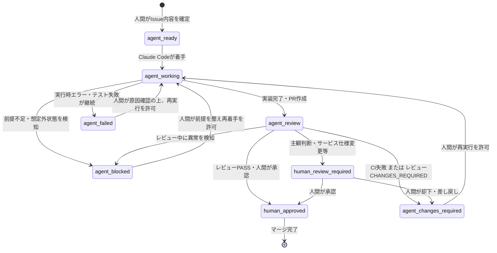

# AUTO-001-02 ラベルと状態遷移の仕様

管理ID: AUTO-001-02

本ドキュメントは、Issue/Pull Requestに付与するラベルの意味と、それらの間の状態遷移を定義する。
今回はラベルと状態遷移の**仕様のみ**を定義し、GitHub上へのラベル作成・GitHub Actionsによる自動付与は行わない（非対象範囲）。

---

## 1. 前提

* ラベルは `Issue`（`agent:ready` 等の着手系）と `Pull Request`（`agent:review` 以降のレビュー系）の両方に用いる。1つのタスク（管理ID）の進行に伴い、Issue側とPR側それぞれに該当ラベルが付与されることを想定する。
* 初期MVPでは、`agent:changes-required` になったタスクをClaude Codeが自動的に再着手することはない。人間が状況を確認し、`agent:working` へ戻す操作（または同等の指示）を行って初めて再着手する。
* すべてのラベルは、対応する状態が「誰の判断で始まり」「誰の判断で終わるか」を明確にするために存在する。人間が付与すべきラベルをAIが自己判断で付与してはならない。

---

## 2. ラベル定義

### `agent:ready`

| 項目 | 内容 |
| --- | --- |
| 意味 | Issueの内容が確定し、Claude Codeが着手してよい状態 |
| 誰が付けるか | 人間 |
| 誰が外すか | Claude Code（着手時、`agent:working` へ遷移する際に外す） |
| 次に遷移可能な状態 | `agent:working` |
| 許可される処理 | Claude Codeによる着手判断、実装計画の検討 |
| 禁止される処理 | このラベルが無い状態でのClaude Codeによる実装着手 |
| 人間確認 | 付与時に必要（Issue内容が実装可能なレベルで確定していることの確認） |

### `agent:working`

| 項目 | 内容 |
| --- | --- |
| 意味 | Claude Codeが実装作業を行っている状態 |
| 誰が付けるか | Claude Code |
| 誰が外すか | Claude Code（`agent:review` へ遷移する際、または `agent:blocked`/`agent:failed` へ遷移する際に外す） |
| 次に遷移可能な状態 | `agent:review`、`agent:blocked`、`agent:failed` |
| 許可される処理 | コード変更、テスト実行、featureブランチへのcommit・push、Pull Request作成 |
| 禁止される処理 | mainへの直接push、自動マージ、人間確認が必要な項目の自己判断での省略 |
| 人間確認 | 不要（ただし異常時は `agent:blocked`/`agent:failed` へ遷移し人間へ報告） |

### `agent:review`

| 項目 | 内容 |
| --- | --- |
| 意味 | 実装が完了し、レビュー（CI・OpenAIレビュー・人間レビュー）待ちの状態 |
| 誰が付けるか | Claude Code（Pull Request作成時） |
| 誰が外すか | レビュー結果に応じて次状態へ遷移する主体（`human:approved` の場合は人間、`agent:changes-required`/`human:review-required` の場合はレビュー実施主体） |
| 次に遷移可能な状態 | `human:approved`、`agent:changes-required`、`human:review-required`、`agent:blocked` |
| 許可される処理 | CIテストの実行、OpenAIレビューの実行、人間によるコードレビュー |
| 禁止される処理 | この状態のPRを人間の承認なしにマージすること |
| 人間確認 | 状態そのものは自動遷移可だが、最終的に `human:approved` へ進むには必ず人間の確認を要する |

### `agent:changes-required`

| 項目 | 内容 |
| --- | --- |
| 意味 | レビュー（CIまたはOpenAIレビュー）の結果、修正が必要と判定された状態 |
| 誰が付けるか | CI（テスト失敗時）、またはOpenAIレビュー結果が `CHANGES_REQUIRED` の場合にレビュー実施主体 |
| 誰が外すか | 人間（修正内容を確認し再実行を許可する場合） |
| 次に遷移可能な状態 | `agent:working`（人間が再実行を許可した場合のみ） |
| 許可される処理 | 人間によるレビュー内容の確認 |
| 禁止される処理 | Claude Codeによる自動的な再着手（初期MVPでは行わない）、このラベルのままでのマージ |
| 人間確認 | 必要（人間が再実行を許可するまで `agent:working` へは戻らない） |

### `human:review-required`

| 項目 | 内容 |
| --- | --- |
| 意味 | 主観判断・サービス仕様変更など、人間の判断が必須な状態 |
| 誰が付けるか | OpenAIレビュー（判定 `HUMAN_REVIEW` の場合）、またはPRテンプレートで「サービス仕様変更あり」等が明記されている場合にレビュー実施主体 |
| 誰が外すか | 人間 |
| 次に遷移可能な状態 | `human:approved`（人間が承認した場合）、`agent:changes-required`（人間が却下し修正を求める場合） |
| 許可される処理 | 人間による内容確認・試聴・目視確認等 |
| 禁止される処理 | このラベルが付いた状態をAIが自動的に `human:approved` へ進めること |
| 人間確認 | 必須 |

### `human:approved`

| 項目 | 内容 |
| --- | --- |
| 意味 | 人間が最終確認し、マージ可能と判断した状態 |
| 誰が付けるか | 人間 |
| 誰が外すか | 人間（マージ完了後にクローズ、または差し戻しが必要になった場合に `agent:changes-required` 等へ再遷移させつつ外す） |
| 次に遷移可能な状態 | （マージをもって完了。差し戻しが必要になった場合のみ `agent:changes-required`） |
| 許可される処理 | 人間によるマージ操作 |
| 禁止される処理 | AIによる自動マージ |
| 人間確認 | 必須（ラベル付与そのものが人間確認の記録） |

### `agent:blocked`

| 項目 | 内容 |
| --- | --- |
| 意味 | 前提不足・入力不備等により、Claude Codeが処理を継続できない状態（実装対象の情報不足、想定外のブランチ状態、conflict等） |
| 誰が付けるか | Claude Code（異常検知時） |
| 誰が外すか | 人間（状況を確認し、Issue/PRを修正した上で外す） |
| 次に遷移可能な状態 | `agent:working`（人間が前提を整え、再着手を許可した場合） |
| 許可される処理 | 人間による状況確認・Issue/PR内容の修正 |
| 禁止される処理 | Claude Codeによる自動的な再着手 |
| 人間確認 | 必須 |

### `agent:failed`

| 項目 | 内容 |
| --- | --- |
| 意味 | 実行時エラー・テスト失敗の継続等、処理そのものが失敗して終了した状態 |
| 誰が付けるか | Claude Code（実行が異常終了した場合） |
| 誰が外すか | 人間（原因を確認し、再実行を許可する場合） |
| 次に遷移可能な状態 | `agent:working`（人間が再実行を許可した場合） |
| 許可される処理 | 人間によるログ・エラー内容の確認 |
| 禁止される処理 | Claude Codeによる自動的な再実行 |
| 人間確認 | 必須 |

---

## 3. 状態遷移図



---

## 4. 状態遷移の要件（テキスト表現）

正常系（最短経路）:

```
agent:ready → agent:working → agent:review → human:approved
```

修正が必要な場合:

```
agent:review → agent:changes-required → (人間の再実行許可) → agent:working
```

人間判断が必要な場合:

```
agent:review → human:review-required
```

（その後 `human:review-required → human:approved` または `human:review-required → agent:changes-required`）

異常時:

```
(任意の自動処理状態: agent:working または agent:review) → agent:blocked または agent:failed
```

---

## 5. 初期MVPでの制約

* `agent:changes-required` からClaude Codeが自動的に再実行されることはない。人間が修正内容を確認し、再実行を許可した時点で初めて `agent:working` へ遷移する。
* `agent:blocked` / `agent:failed` からの復帰も同様に、人間の確認・許可が前提となる。
* いかなる状態からも、AIの判断のみで `human:approved` へ遷移することはない。
* マージ操作そのものは常に人間が行う。

---

## 6. Issue本文（Markdown Issueテンプレート）・Pull Requestテンプレートとの対応

管理ID: AUTO-001-04D-R2（本セクションの改訂）

### 6.1 正式な入力契約はMarkdown Issue本文1つであること

AUTO-001-04D-R2以降、AI実装タスクの正式な入力契約は、複数の入力欄を持つGitHub Issue Form（YAML形式）ではなく、**単一のMarkdown Issue本文**である。

想定する運用は以下の通り。

1. ユーザーがChatGPT等と課題について会話する。
2. ChatGPT等が目的・期待動作・非対象範囲・受入条件等を整理する。
3. ChatGPT等が完成したIssueタイトルとMarkdown本文を出力する。
4. ユーザーがGitHubの新規Issue作成画面で、テンプレート（`.github/ISSUE_TEMPLATE/agent_task.md`）を選び、タイトルと本文をそれぞれ1回ずつ貼り付ける。

ユーザーの正式な操作は**「タイトル貼り付け1回、本文貼り付け1回」**であり、個別のフィールドへ何度もコピー&ペーストする操作は発生しない。

### 6.2 正式な見出し一覧(固定契約)

Issue本文は、`<!-- AGENT_TASK_SPEC_START -->`と`<!-- AGENT_TASK_SPEC_END -->`という開始・終了コメントで囲まれた範囲の中に、以下の見出しを**この順序・この名称で各1回だけ**含む。見出し名の表記揺れ（同義語の併記）は許可しない。開始・終了コメントについても、それぞれ本文中に1回だけ存在しなければならない。

#### 構造上の必須セクション(12件)

見出し自体が、内容の有無にかかわらず、この順序・この名称で必ず1回ずつ存在しなければならない。

1. `## 管理ID`
2. `## 現在の問題`
3. `## 原因に関する仮説`
4. `## 目的`
5. `## 期待動作・決定事項`
6. `## 非対象範囲`
7. `## 受入条件`
8. `## テスト観点`
9. `## リスク`
10. `## 人間確認事項`
11. `## 変更区分`
12. `## 参考資料`

#### 実質的な記載が必須のセクション(8件)

以下は見出しが存在するだけでなく、**空欄および「なし」を認めない**。具体的な内容の記載を必須とする。

* `## 管理ID`
* `## 現在の問題`
* `## 目的`
* `## 期待動作・決定事項`
* `## 非対象範囲`
* `## 受入条件`
* `## テスト観点`
* `## 変更区分`

#### 「なし」を認めるセクション(4件)

以下は該当が無い場合に限り、本文に**「なし」**と明記することを認める(見出しごと削除することは認めない)。

* `## 原因に関する仮説`
* `## リスク`
* `## 人間確認事項`
* `## 参考資料`

この区分(構造上の必須12件・実質必須8件・「なし」許容4件)を、将来のAUTO-001-05 preflight validationの検証契約として明記する。

### 6.3 開始・終了コメントの用途

`<!-- AGENT_TASK_SPEC_START -->` / `<!-- AGENT_TASK_SPEC_END -->` は、Issue本文中のどこからどこまでが機械可読な構造化タスク仕様かを示す境界マーカーである。GitHubのPreview表示では通常のHTMLコメントとして扱われ、見出しの読みやすさを損なわない。AUTO-001-05以降、Issue本文を解析するツールがこのマーカーの内側だけを対象とすることを想定している。

### 6.4 受入条件IDの形式

`## 受入条件`セクション内の各条件には、`AC-01`、`AC-02`のように**連番かつ一意な条件ID**を付与する(チェックボックス`- [ ] AC-01: ...`形式)。この条件IDは、Pull Requestテンプレートの「受入条件ごとの結果」表、および`claude_implementation_report.schema.json` / `openai_review_result.schema.json`の`criterion_id`と対応する(両Schema自体はAUTO-001-04D-R2では変更していない)。

### 6.5 GitHub側での検証範囲

GitHub Issue テンプレート機能(Markdown形式)は、YAML Issue Formと異なり、セクション単位の必須入力チェックや入力形式の強制を行わない。したがって、見出しの過不足・「なし」の記載漏れ・受入条件IDの付け忘れ等は、**GitHub側では検証されない**。

### 6.6 AUTO-001-05での本文検証(予定)

AUTO-001-05にて、Claude Code起動前にIssue本文の構造を機械的に検証する「preflight validation」を実装する予定である(本ドキュメント時点では未実装)。preflightは、開始・終了コメントの存在、§6.2の見出し過不足、必須セクションの非空性、受入条件IDの形式等を検証することを想定する。**preflightが不合格となった場合、Claude Codeによる実装は開始しない方針**とする。

### 6.7 サービス仕様変更・運用仕様変更の扱い

`## 変更区分`セクションで「サービス仕様変更：あり」または同等の記載がある場合、対応するPRは`agent:review`から自動的に`human:approved`へは進めず、`human:review-required`を経由する運用とする(この方針自体はYAML Form時代から変更していない)。
